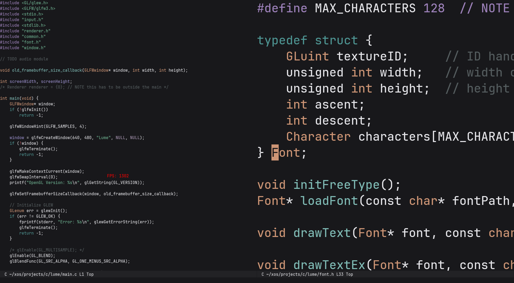

<div align="center">

<div style="float: right">

</div>


*A modern, hardware-accelerated rewrite of Emacs in C and OpenGL*

[](https://www.gnu.org/licenses/gpl-3.0)
[]()
[]()

[Installation](#installation) •
[Features](#features) •
[Documentation](#documentation) •

</div>

## Overview



## Features

### 🚀 Modern Architecture
- **Hardware-accelerated rendering** powered by OpenGL through the Lume engine
- **Blazing-fast performance** with native C implementation
- **Runtime extensibility** using C without VM overhead
- **Tree-sitter integration** for robust syntax analysis

### 🎨 Advanced Text Editing
- **Smart Cursor Behavior**
  - Crystal cursor mode that adapts to syntax context
  - Customizable blinking with configurable intervals
  - Emacs-style intelligent cursor movement
  
- **Sophisticated Buffer Management**
  - Independent window scrolling
  - Per-window cursor positions (not true TODO)

- **Emacs-Compatible Features**
  - Kill ring for advanced cut/paste operations
  - Mark and region
  - Incremental search (I-search)
  - Electric pair and rainbow mode
  - Tree-sitter powered syntax highlighting
  - Flexible window management

## Key Bindings
NOTE: They are still hardcoded in the callback functions

### Universal argument
- `C-0..9` - Digit argument

### File Operations
- `C-x C-f` - Find file
- `C-x C-s` - Save buffer
- `C-x C-q` - Read only mode

### Navigation
- `C-n` - Next line
- `C-p` - Previous line
- `M-n` - Forward paragraph
- `M-p` - Backward paragraph
- `M-b` - Backward word
- `C-f` - Forward character
- `C-b` - Backward character
- `M-f` - Forward word
- `C-e` - Move to end of line
- `C-a` - Move to beginning of line
- `M->` - End of buffer
- `M-<` - Beginning of buffer

### Editing
- `C-space` - Set mark
- `C-d` - Delete character/kill region
- `C-k` - Kill line/kill region
- `C-y` - Yank
- `M-w` - Kill ring save
- `C-w` - Kill region
- `C-o` - Open line
- `C-O` - Duplicate line
- `M-c` - Capitalize word

### Extension
- `C-j` - Eval last sexp
- `R-e` - Eval region


### Search
- `C-s` - Incremental search forward
- `C-r` - Incremental search backward

### Window Management
- `M-q` / `C-x 0` - Delete window
- `M-j` / `C-x 2` - Split window below
- `M-k` - Split window above
- `M-h` - Split window left
- `M-l` / `C-x 3` - Split window right

### Customization
- `M-=` - Next theme
- `M--` - Previous theme
- `C-=` - Increase font size
- `C--` - Decrease font size

For the complete list of keybindings, start reading the `keyCallback()` function in `main.c`.

## Installation

### Prerequisites
- FreeType
- Tree-sitter
- OpenGL 4.6+
- GLFW
- Lume engine

### Build Instructions

1. Clone and install the Lume library:
```bash
git clone https://github.com/laluxx/lume.git
cd lume
make && make install
```

2. Clone build and run Glemax:
```bash
cd
git clone https://github.com/laluxx/glemax.git
cd glemax
make && ./glemax
```

## TODO
- [ ] Iedit mode
- [ ] Rainbow delimiters mode
- [ ] Undo system
- [ ] Fringe implementation
- [ ] Dired and wdired
- [ ] Proced functionality
- [ ] Org-mode support
- [ ] Runtime variable/function inspection
- [ ] Integrated debugger
- [ ] Eshell implementation
- [ ] EWW browser
- [ ] C evaluation support

## License
This project is licensed under the GNU General Public License v3.0 - see the [LICENSE](LICENSE) file for details.
