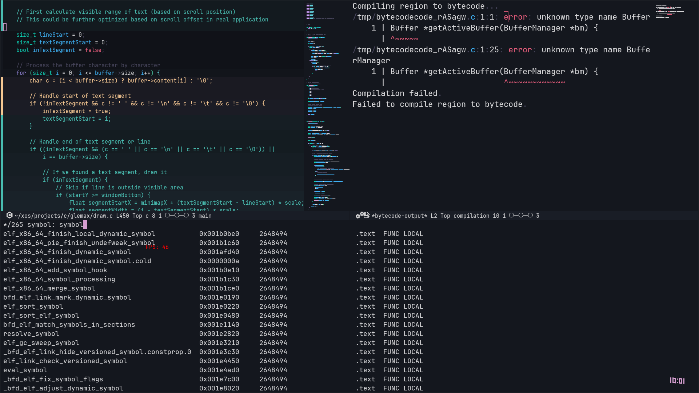

<div align="center">

<div style="float: right">

</div>


*A modern, hardware-accelerated rewrite of Emacs in C and OpenGL*

[](https://www.gnu.org/licenses/gpl-3.0)
[]()
[]()

[Installation](#installation) •
[Features](#features) •
[Documentation](#documentation) •

</div>

## Overview




For the complete list of keybinds, start reading the `keyCallback()` function in `main.c`.
we don't have recursive major modes yet.

## Installation

### Prerequisites
- FreeType
- Tree-sitter
- OpenGL 4.6+
- GLFW
- Lume engine

### Build Instructions

1. Clone and install the Lume library:
```bash
git clone https://github.com/laluxx/lume.git
cd lume
make && sudo make install
```

2. Clone build and run Glemax:
```bash
git clone https://github.com/laluxx/glemax.git
cd glemax
make && ./glemax
```

## TODO
idk look for them if you really care

## License
This project is licensed under the GNU General Public License v3.0 - see the [LICENSE](LICENSE) file for details.
